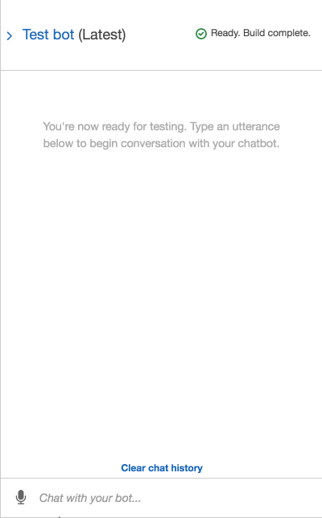

# Unit 13 Homework Assignment - The Power of the Cloud and Unsupervised Learning

## Robo Advisor for Retirement Plans

*Photo by [Alex Knight](https://www.pexels.com/@alex-knight-1272316?utm_content=attributionCopyText&utm_medium=referral&utm_source=pexels) from [Pexels](https://www.pexels.com/photo/high-angle-photo-of-robot-2599244/?utm_content=attributionCopyText&utm_medium=referral&utm_source=pexels) | [Free License](https://www.pexels.com/photo-license/)*

### Background

I was hired as a digital transformation consultant by one of the most prominent retirement plan providers in the country; they want to increase their client portfolio, especially by engaging young people. Since machine learning and NLP are disrupting finance to improve customer experience, I created a robo advisor that could be used by customers or potential new customers to get investment portfolio recommendations for retirement.

In this homework assignment, I combined my new Amazon Web Services skills with my already mastered Python superpowers, to create a bot that will recommend an investment portfolio for a retirement plan.

I accomplished the following main tasks:

1. **[Initial Robo Advisor Configuration:](#Initial-Robo-Advisor-Configuration)** Defined an Amazon Lex bot with a single intent that establishes a conversation about the requirements to suggest an investment portfolio for retirement.

2. **[Built and Tested the Robo Advisor](#Build-and-Test-the-Robo-Advisor):** Ensured the bot is working and responding accurately along with the conversation with the user by building and testing it.

3. **[Enhanced the Robo Advisor with an Amazon Lambda Function:](#Enhance-the-Robo-Advisor-with-an-Amazon-Lambda-Function)** Created an Amazon Lambda function that validates the user's input and returns the investment portfolio recommendation. This task includesd testing the Amazon Lambda function and making the integration with the bot.

---

### Files

* [lambda_function.py](Lambda_Function/lambda_function.py)
* [correct_dialog.txt](Test_Cases/correct_dialog.txt)
* [age_error.txt](Test_Cases/age_error.txt)
* [incorrect_amount_error.txt](Test_Cases/incorrect_amount_error.txt)
* [negative_age_error.txt](Test_Cases/negative_age_error.txt)

---

### Instructions

#### Initial Robo Advisor Configuration

In this section, I created the `RoboAdvisor` bot and added an intent with its corresponding slots.

Created the `RecommendPortfolio` intent, and configured some sample utterances as follows:

* I want to save money for my retirement
* I'm ​`{age}​` and I would like to invest for my retirement
* I'm `​{age}​` and I want to invest for my retirement
* I want the best option to invest for my retirement
* I'm worried about my retirement
* I want to invest for my retirement
* I would like to invest for my retirement

This bot uses four slots, three using built-in types for `firstName`, `age` & `investmentAmount` as well and one custom slot named `riskLevel`. 

The response cards were formatted for the intent.

#### Test the Robo Advisor

Once my Robo Advisor was built I tested it in the chatbot window.

#### Enhanced the Robo Advisor with an Amazon Lambda Function

I created an Amazon Lambda function from scratch that validated the data provided by the user on the Robo Advisor. The new lambda function was named `recommendPortfolio` and I selected Python 3.7 as runtime.

I deleted the AWS generated default lines of code, then pasted in the starter code provided in [lambda_function.py](Lambda_Function/lambda_function.py) and completed the `recommend_portfolio()` function by following these guidelines:

##### User Input Validation

* The `age` should be greater than zero and less than 65.
* the `investment_amount` should be equal to or greater than 5000.

##### Investment Portfolio Recommendation

Once the intent is fulfilled, the bot will respond with an investment recommendation based on the selected risk level as follows:

* **none:** "100% bonds (AGG), 0% equities (SPY)"
* **very low:** "80% bonds (AGG), 20% equities (SPY)"
* **low:** "60% bonds (AGG), 40% equities (SPY)"
* **medium:** "40% bonds (AGG), 60% equities (SPY)"
* **high:** "20% bonds (AGG), 80% equities (SPY)"
* **very high:** "0% bonds (AGG), 100% equities (SPY)"

Once I finished coding my lambda function, I tested it using the [sample test cases](Test_Cases/) provided for this homework.

After successfully testing my code, I opened the Amazon Lex Console and navigated to the `RecommendPortfolio` bot configuration, then integrated my new lambda function by selecting it in the _Lambda initialization and validation_ and _Fulfillment_ sections. Once I built my bot, I had a conversation as follows.

### Submission

I created a brand new repository in GitHub and uploaded the following files to your repo.

* A python script with your final lambda function.

* From the Amazon Lex Console, export your bot, intent, and slot using `Amazon Lex` as the target platform, and upload the ZIP files to your repo.

* Create a short video or animated GIF showing a demo of your Robo Advisor in action from the test window. Upload the video or animated GIF file to your repo.

---

© 2021 Trilogy Education Services, a 2U, Inc. brand. All Rights Reserved.
